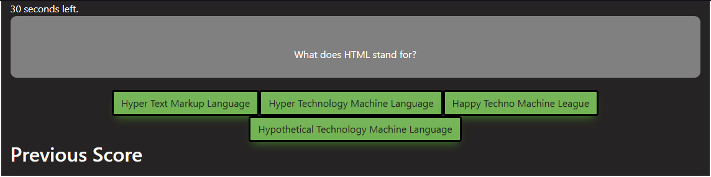

# CodeQuiz
Interactive Web Development Quiz

For this assignment I was tasked to create a timed, dynamically updated JavaScript quiz that met the following criteria:

GIVEN I am taking a code quiz
WHEN I click the start button
THEN a timer starts and I am presented with a question
WHEN I answer a question
THEN I am presented with another question
WHEN I answer a question incorrectly
THEN time is subtracted from the clock
WHEN all questions are answered or the timer reaches 0
THEN the game is over
WHEN the game is over
THEN I can save my initials and score

In my javascript file I created an array of questions, containing an array of answers for each question and a property of "correct" which is true or false. 

The function that begins the quiz starts a timer, shows the initial question, and generates buttons for each possible answer to the question.

When a user selects a button, the question index is incremented and the new question & answers appears. If the dataset value for the button was true, the score is incremented as well.

When the Quiz runs out of questions, a function is called ending the quiz and creates an input field for the user to type in their initials.

The user's initials and corresponding score are then saved to local storage and displayed. The user can then opt to try the quiz again. 

You can see the deployed application by using the following address: https://ubern00bie.github.io/CodeQuiz/

Contact info: jbenningfield.dev@gmail.com

## License
 
The MIT License (MIT)

Copyright (c) 2015 Chris Kibble

Permission is hereby granted, free of charge, to any person obtaining a copy of this software and associated documentation files (the "Software"), to deal in the Software without restriction, including without limitation the rights to use, copy, modify, merge, publish, distribute, sublicense, and/or sell copies of the Software, and to permit persons to whom the Software is furnished to do so, subject to the following conditions:

The above copyright notice and this permission notice shall be included in all copies or substantial portions of the Software.

THE SOFTWARE IS PROVIDED "AS IS", WITHOUT WARRANTY OF ANY KIND, EXPRESS OR IMPLIED, INCLUDING BUT NOT LIMITED TO THE WARRANTIES OF MERCHANTABILITY, FITNESS FOR A PARTICULAR PURPOSE AND NONINFRINGEMENT. IN NO EVENT SHALL THE AUTHORS OR COPYRIGHT HOLDERS BE LIABLE FOR ANY CLAIM, DAMAGES OR OTHER LIABILITY, WHETHER IN AN ACTION OF CONTRACT, TORT OR OTHERWISE, ARISING FROM, OUT OF OR IN CONNECTION WITH THE SOFTWARE OR THE USE OR OTHER DEALINGS IN THE SOFTWARE.